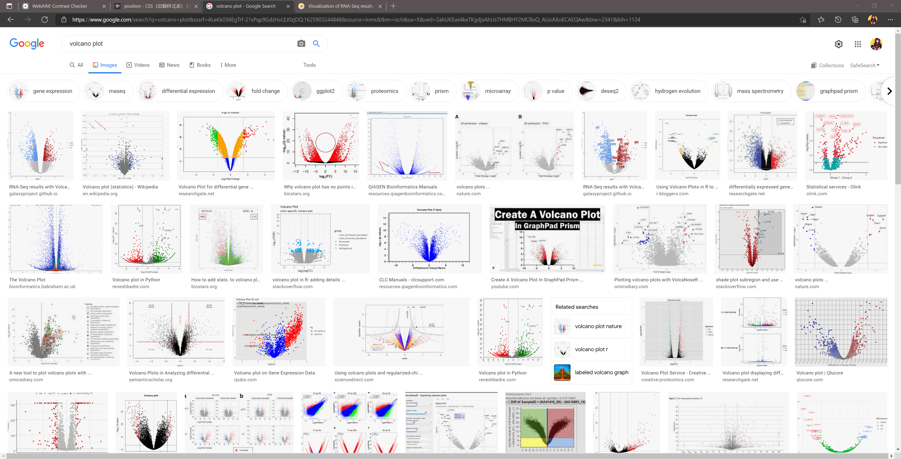

class: title-slide, middle, center
background-image: url("biotrainee_elements/back_f.png")
background-position: contain
background-size: 100%, cover

```{r meta, echo=FALSE, warning=FALSE}
library(metathis,quietly = TRUE)
meta() %>%
  meta_general(
    description = "漂亮的火山图是怎么的做的",
    generator = "xaringan and remark.js"
  ) %>% 
  meta_name("github-repo" = "xiayh17/niceVolcanoX") %>% 
  meta_social(
    title = "使用xaringan介绍自己的工作",
    url = "https://xiayh17.github.io/niceVolcano/slides/HowToNiceVolcano.html#1",
    image = "https://cdn.jsdelivr.net/gh/xiayh17/Figs/imgs/android-chrome-512x512.png",
    image_alt = "Title slide for the day 1 slides of the Sharing Your Work with xaringan workshop series",
    og_type = "website",
    og_author = "Yonghe Xia"
  )
```

```{r setup, include=FALSE}
#xaringan::summon_remark()
options(htmltools.dir.version = FALSE, htmltools.preserve.raw = FALSE)
library(knitr)
library(xaringanExtra)
library(icons)

# set engines
knitr::knit_engines$set("markdown")
```

```{r xaringanExtra, echo=FALSE}
xaringanExtra::use_xaringan_extra(c("title_view","clipboard","search","scribble"))
```

```{r dep-tile-view, echo=FALSE}
xaringanExtra::use_tile_view()
```

```{r xaringan-logo, echo=FALSE}
xaringanExtra::use_logo(
  image_url = "biotrainee_elements/logo.png",
  position = xaringanExtra::css_position(top = "-0.2em", right = "0em")
)
```


# `r rmarkdown::metadata$title`
## `r rmarkdown::metadata$subtitle`

### **`r rmarkdown::metadata$author`**<br>
### `r rmarkdown::metadata$date`


---
background-image: url("biotrainee_elements/back_c.png")
background-position: contain
background-size: 100%

# 火山图的基本形态

```{r volcano_overview,echo=FALSE}

```


---
name: hello
class: middle, left, hide-logo
background-image: url("biotrainee_elements/back_c.png")
background-position: contain
background-size: 100%, cover

# Outline

----


.pull-left[

Outline slides like this one are commonly found in the wild. If they incorporate links they can become a useful "table of contents" for a slide deck.  

Downside is they aren't very memorable. I would encourage a "roadmap" approach to your presentations, using interesting transition slides that let your audience know where you've been and where you're going next.

]<!--end of left-column-->

.pull-right[
.left[
1\. [Making bullet points and emphasizing text](#bulletpoints)

2\. [Tables and quotes](#tables-quotes)

3\. [Line highlighting](#line-highlighting)

4\. [Final slide and contact info](#goodbye)
]
] <!--end of right-column-->

---

name: hello
class: middle, center, hide-logo


# NHS-R Community 

## Promoting the use of R in the NHS

---